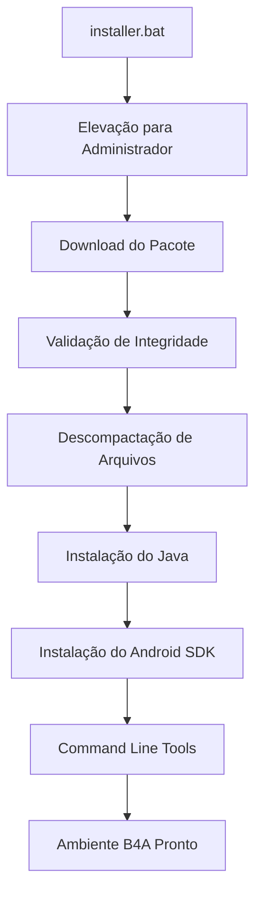

# Estrategias-de-Presen-a-Tecnica-e-Portfolio
Estratégias de Presença Técnica e Portfólio

> **Guia Prático para Desenvolvedores:** Como integrar GitHub, Medium, LinkedIn e site próprio para construir um portfólio técnico de alto impacto.

---

## Prefácio

Este documento apresenta uma análise estratégica sobre a construção de presença técnica e marca pessoal no mercado de desenvolvimento de software.

**Tópicos abordados:**
* **GitHub × Medium:** O papel de cada plataforma e como recrutadores as interpretam.
* **Projetos Reais vs. Tutoriais Genéricos:** Exemplo de temas para tutoriais orientados a resolução de problemas.
* **Estratégia Artigo + Repositório:** O fluxo integrado entre artigo expositivo e código-fonte funcional.
* **Uso Estratégico do LinkedIn:** Transformando projetos e artigos em visibilidade e *networking*.
* **Domínio Próprio:** A importância de criar um blog/portfólio sob seu próprio domínio (`ipagesoftware.com.br`).
* **Linha Editorial & Fluxo de Produção:** Diretrizes para criar, publicar e priorizar conteúdo técnico.
* **Plano Inicial:** Ações práticas e passo a passo recomendado.

---

## 1. Visão Geral

A ideia central desta análise é que **GitHub e Medium não devem ser vistos como plataformas concorrentes**. Elas cumprem funções complementares e funcionam melhor quando integradas:

> 💡 **Princípio Chave:**
> * **GitHub** demonstra o que você **sabe fazer** (código, arquitetura e execução).
> * **Medium** demonstra que você **sabe explicar** o que faz (raciocínio, comunicação e tomadas de decisão).

Para um profissional de tecnologia, essa combinação ganha escala com o **LinkedIn** (que amplia a visibilidade profissional) e com um **Site Próprio** (que garante soberania e controle sobre o conteúdo no longo prazo).

---

## 2. GitHub × Medium

### Comparativo de Plataformas

| Critério | GitHub | Medium |
| :--- | :---: | :---: |
| **Mostrar código** | ★★★★★ | ★★☆☆☆ |
| **Mostrar projetos reais** | ★★★★★ | ★★☆☆☆ |
| **Portfólio profissional** | ★★★★★ | ★★★☆☆ |
| **Tutoriais e documentação** | ★★★☆☆ | ★★★★★ |
| **Explicar soluções e arquitetura** | ★★★☆☆ | ★★★★★ |
| **Compartilhar ideias e bastidores** | ★★★☆☆ | ★★★★★ |
| **Ser encontrado por desenvolvedores** | ★★★★★ | ★★★★☆ |
| **Mostrar capacidade de comunicação** | ★★★☆☆ | ★★★★★ |
| **Avaliação por recrutadores** | **Muito relevante** | **Complementar** |

> 📊 **Dados de Mercado:**  
> O próprio **GitHub** recomenda utilizar o perfil para demonstrar habilidades a *hiring managers* (gerentes de contratação), enfatizando um `README.md` profissional e repositórios relevantes.  
> Além disso, no *Developer Survey 2025* do **Stack Overflow**, o GitHub figura entre as plataformas comunitárias mais utilizadas e é a ferramenta mais desejada para documentação e colaboração de código.

---

### Abordagem Prática: Fuja dos Tutoriais Genéricos

A grande vantagem competitiva está em evitar tutoriais genéricos ("Como fazer X") e focar em **problemas reais resolvidos**:

* **JavaScript:**
  * ❌ *Em vez de:* "Como usar addEventListener"
  * ✅ *Escreva:* **"Como eliminei jQuery de um sistema legado e migrei seus eventos para JavaScript moderno"**
* **PHP:**
  * ❌ *Em vez de:* "Como usar PDO"
  * ✅ *Escreva:* **"Refatorando uma aplicação PHP legada: de código procedural para uma estrutura mais organizada"**
* **PWA (Progressive Web App):**
  * ❌ *Em vez de:* "O que é Service Worker"
  * ✅ *Escreva:* **"Como implementei modo offline em uma PWA e resolvi o erro *'Failed to execute addAll on Cache'*"**
* **Windows / Automação / B4A:**
  * ❌ *Em vez de:* "Comandos básicos de Batch"
  * ✅ *Escreva:* **"Criando um instalador automatizado para Java, Android e B4A usando Batch e PowerShell"**

---

### O Fluxo da Automação B4A (Exemplo Prático)



---

### Conectando o GitHub ao Medium

Não coloque apenas o código no GitHub. **Faça o GitHub ser o projeto e o Medium a história do projeto.**

#### Estrutura do Repositório (GitHub)

```text
b4a-installer/
├── installer.bat
├── README.md
├── LICENSE
└── docs/
```

#### No `README.md` do GitHub:

```markdown
# B4A Installer
Instalador automatizado do ambiente B4A para Windows.

## Recursos
- Instalação automatizada do Java e Android SDK
- Configuração do Android Command Line Tools e B4A
- Download automático e verificação de integridade dos pacotes
- Menu interativo via CLI

## Tecnologias
- Windows Batch / PowerShell
- Java / Android SDK / B4A
```

#### No Artigo (Medium):
**Título:** *"Como criei um instalador automatizado para o ambiente B4A"*  
**Conteúdo:** Explique o porquê da solução, desafios encontrados, decisões arquiteturais, tratamento de erros e aprendizados.  
**Chamada Final:** `👉 Código-fonte completo disponível no GitHub: [link-para-o-repositorio]`

---

### O Triângulo da Presença Digital

```text
                    VOCÊ
                     │
          ┌──────────┼──────────┐
          │          │          │
          ▼          ▼          ▼
       GitHub      Medium    LinkedIn
          │          │          │
          ▼          ▼          ▼
       PROVA      CONTEÚDO    VISIBILIDADE
          │          │          │
          ▼          ▼          ▼
       Código     Artigos     Networking
       Projetos   Tutoriais   Empresas
       Sistemas   Ideias      Recrutadores
```

* **GitHub:** *"Olhe o que eu construí."*
* **Medium:** *"Veja como eu penso e como resolvo problemas."*
* **LinkedIn:** *"Veja minha trajetória e impacto profissional."*

---

### Marca Pessoal & Domínio Próprio (`ipagesoftware.com.br`)

O Medium é um ótimo canal de distribuição, mas não deve ser o único repositório da sua propriedade intelectual. O ideal é estruturar seu próprio domínio:

```text
ipagesoftware.com.br/
├── /blog       ──> Artigos técnicos e análises
├── /projetos   ──> Portfólio de sistemas construídos
├── /tutoriais  ──> Guias passo a passo
└── /sobre      ──> Trajetória profissional e contato
```

**Estratégia de Distribuição Integrada:**
1. **Seu Site:** Publicação original do artigo completo.
2. **Medium:** Republicação ou versão adaptada para alcançar a comunidade.
3. **LinkedIn:** Resumo com os principais insights e link para leitura completa.
4. **GitHub:** Repositório com o código funcional testado.

---

## 3. Como Empresas e Recrutadores Interpretam essa Presença

Um currículo tradicional apenas **declara** conhecimentos; um ecossistema bem construído **demonstra** competência técnica:

* **Currículo:** Apresenta competências, formação e histórico profissional.
* **GitHub:** Valida a qualidade do código, organização, arquitetura e capacidade de entrega.
* **Medium / Blog:** Valida capacidade de comunicação, documentação técnica e raciocínio analítico.
* **LinkedIn:** Conecta a pessoa ao mercado, facilitando abordagens de recrutadores e parcerias.
* **Site Próprio:** Consolida a autoridade de marca e a identidade profissional.

---

## 4. Que Tipo de Conteúdo Publicar

### 4.1 JavaScript e Sistemas Legados
* **Tema:** *Como eliminei jQuery de um sistema legado e migrei seus eventos para JavaScript moderno.*
* **Foco Técnico:** Refatoração, escopo (`const`/`let`), manipulação do DOM, `Fetch API`, `async/await` e remoção de dependências legadas.

### 4.2 PHP
* **Tema:** *Refatorando uma aplicação PHP legada: de código procedural para uma estrutura mais organizada.*
* **Foco Técnico:** Padrão MVC, uso de PDO com *Prepared Statements*, segurança (prevenção contra SQL Injection), separação de responsabilidades e atualização de versão do PHP.

### 4.3 PWA (Progressive Web Apps)
* **Tema:** *Como implementei modo offline em uma PWA e resolvi o erro 'Failed to execute addAll on Cache'.*
* **Foco Técnico:** Ciclo de vida do Service Worker, estratégias de cache (*Cache First*, *Network First*), tratamento de requisições com falha e *debug* de chamadas HTTP.

### 4.4 Windows, Automação e B4A
* **Tema:** *Criando um instalador automatizado para Java, Android e B4A usando Batch e PowerShell.*
* **Foco Técnico:** Elevação de privilégios administrativa, requisições de download silenciosas via PowerShell, descompactação automatizada de `.zip` e validação de variáveis de ambiente (`PATH`).

---

## 5. Como Organizar o GitHub

Um repositório de qualidade não se resume a arquivos de código soltos. Ele deve contar uma história através da documentação:

### Estrutura Sugerida:

```text
b4a-installer/
├── installer.bat
├── README.md
├── LICENSE
└── docs/
    ├── architecture.png
    └── usage-guide.md
```

### Elementos Essenciais de um Bom `README.md`:
1. **Título e Descrição Clara:** O que o projeto faz em poucas linhas.
2. **Problema que Resolve:** Por que o projeto foi criado.
3. **Principais Recursos:** Lista com marcações (*bullet points*).
4. **Tecnologias Utilizadas:** Linguagens, *frameworks* e ferramentas.
5. **Guia de Instalação e Execução:** Comandos necessários para rodar localmente.
6. **Capturas de Tela ou GIFs:** Demonstração do funcionamento.
7. **Licença:** Ex: MIT, Apache 2.0.
8. **Link para Artigo Relacionado:** Direcionamento para a explicação completa no Medium/Blog.

---

## 6. A Estratégia Mais Forte: Artigo + Projeto

```text
[ MEDIUM / BLOG ]
       │  
       │  (Artigo explicando o problema, decisões e arquitetura)
       ▼
[ GITHUB ]
       │  
       │  (Código-fonte completo, estrutura e instruções de execução)
       ▼
[ PROVA PRÁTICA ]
```

---

## 7. O Papel do LinkedIn

O LinkedIn é o canal de **distribuição e visibilidade**. Para cada projeto ou artigo relevante lançado:

1. Escreva um post curto e direto no LinkedIn sintetizando o desafio.
2. Destaque 2 ou 3 aprendizados principais.
3. Inclua uma imagem visual ou captura de tela do projeto.
4. Adicione o link para o artigo completo e/ou repositório nos comentários ou no corpo da postagem.

---

## 8. Estrutura do Site Próprio (`ipagesoftware.com.br`)

Manter uma central de conteúdo própria consolida a sua marca no mercado:

```text
https://ipagesoftware.com.br
│
├── /blog       ──> Artigos técnicos aprofundados
├── /projetos   ──> Showcase de sistemas construídos
├── /tutoriais  ──> Guias rápidos de solução de problemas
└── /sobre      ──> Perfil, experiências e contatos
```

---

## 9. Matriz de Prioridades Recomendada

```text
1. GitHub      (⭐⭐⭐⭐⭐ - Prioridade Máxima) ──> Projetos reais e README impecável.
2. LinkedIn    (⭐⭐⭐⭐⭐ - Prioridade Máxima) ──> Divulgação e networking ativo.
3. Medium      (⭐⭐⭐⭐☆ - Prioridade Alta)   ──> Publicação de artigos focados em problemas reais.
4. Site Próprio (⭐⭐⭐⭐☆ - Longo Prazo)       ──> Centralização da marca e soberania de conteúdo.
```

> 📌 **Qualidade > Quantidade:** É infinitamente superior ter **5 artigos excelentes** que resolvem problemas complexos do que **20 tutoriais superficiais**.

---

## 10. Linha Editorial Sugerida

A sua linha editorial pode ser construída ao redor de tópicos onde você já possui experiência prática:

* Refatoração de sistemas legados
* JavaScript moderno & Migração de bibliotecas (jQuery -> ES6+)
* PHP moderno, PDO e Segurança Web
* APIs e Comunicação Front-end / Back-end
* PWA (Progressive Web Apps) & Aplicações Offline
* Automação de ambientes em Windows (Batch / PowerShell)
* Desenvolvimento Mobile / Híbrido (B4A, Java, Android)
* Decisões de Arquitetura & Lições Aprendidas em Produção

---

## 11. Fluxo de Produção de Conteúdo

1. **Identificação:** Escolha um problema real enfrentado no dia a dia.
2. **Contextualização:** Registre o cenário, as limitações e o objetivo.
3. **Solução:** Desenvolva e valide a solução técnica.
4. **Código:** Destaque os trechos mais relevantes e limpos de código.
5. **Erros & Alternativas:** Documente falhas ocorridas e opções descartadas.
6. **Resultados:** Demonstre os ganhos de performance ou usabilidade.
7. **Repositório:** Suba o projeto estruturado no **GitHub**.
8. **Artigo:** Escreva a explicação detalhada no **Medium / Blog**.
9. **Redes:** Publique um resumo de alto engajamento no **LinkedIn**.
10. **Manutenção:** Mantenha os links e dependências atualizados.

---

## 12. Avaliação Final das Plataformas

| Plataforma | Função Principal | Impacto no Perfil | Prioridade |
| :--- | :--- | :---: | :---: |
| **GitHub** | Código-fonte, arquitetura e prova prática de execução | **Altíssimo** | ⭐⭐⭐⭐⭐ (Máxima) |
| **LinkedIn** | Visibilidade profissional, *networking* e conexões | **Altíssimo** | ⭐⭐⭐⭐⭐ (Máxima) |
| **Medium** | Explicação de conceitos, tutoriais e raciocínio técnico | **Alto** | ⭐⭐⭐⭐☆ (Alta) |
| **Site Próprio** | Centralização da marca pessoal, blog e autonomia | **Alto** | ⭐⭐⭐⭐☆ (Estratégico) |

---

## 13. Plano Inicial de Ação (Passo a Passo)

- [ ] **Passo 1:** Selecionar **2 ou 3 projetos reais** do seu portfólio que melhor representem suas habilidades técnicas atuais.
- [ ] **Passo 2:** Reescrever e profissionalizar o `README.md` desses repositórios no **GitHub**.
- [ ] **Passo 3:** Escolher um problema técnico marcante (ex: instalador B4A ou refatoração PHP/JS) para ser o **primeiro artigo**.
- [ ] **Passo 4:** Redigir o artigo no **Medium** com linguagem didática, trechos de código e link para o GitHub.
- [ ] **Passo 5:** Criar uma publicação no **LinkedIn** sintetizando a solução e convidando para a leitura.
- [ ] **Passo 6:** Manter um ritmo sustentável de publicação (ex: 1 artigo/projeto por mês).
- [ ] **Passo 7:** Estruturar futuramente a seção `/blog` dentro do domínio `ipagesoftware.com.br`.

---

## 14. Observações sobre Mercado e Fontes

As orientações oficiais do **GitHub** reforçam o uso do repositório de perfil (`username/username`) e dos repositórios públicos como ferramentas ativas de apresentação para *tech leads* e recrutadores.

As pesquisas anuais da comunidade de tecnologia (como o **Stack Overflow Developer Survey**) confirmam consistentemente que **documentação de qualidade** e **exemplos práticos** são os recursos de aprendizagem e avaliação mais valorizados por desenvolvedores em todo o mundo.
